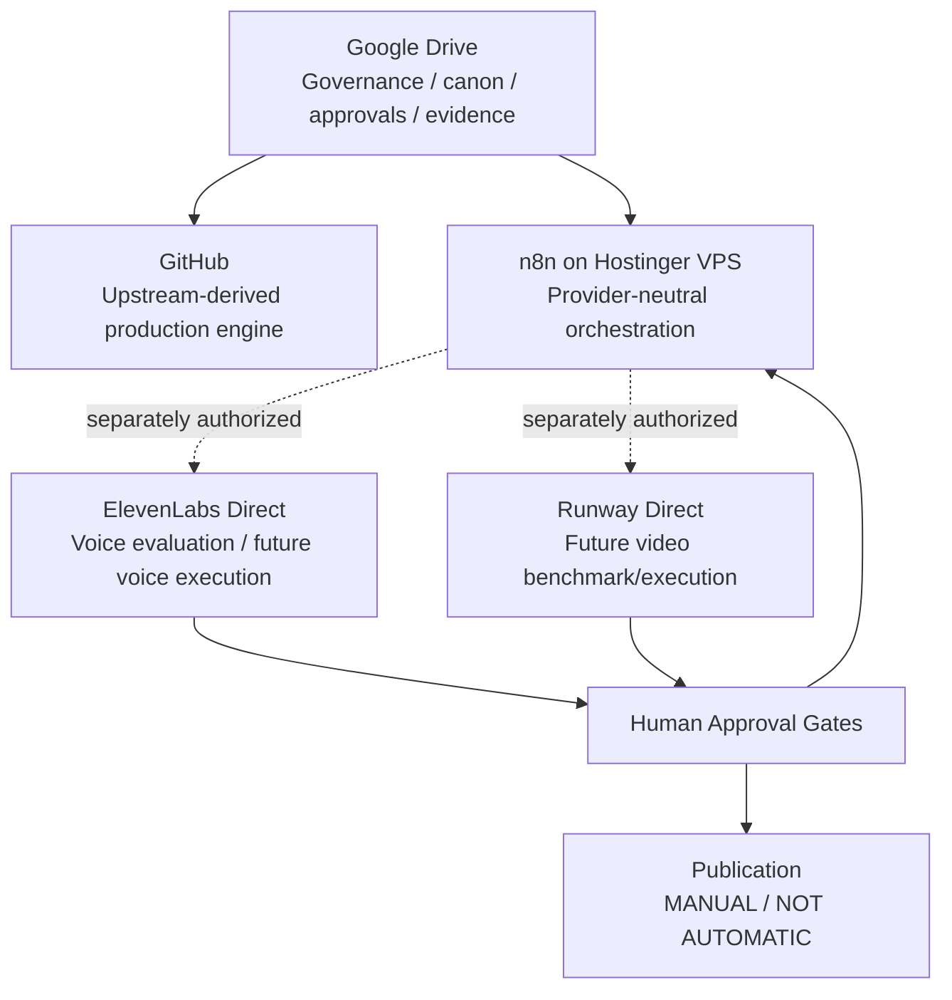
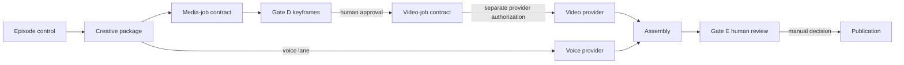

# ARCHITECTURE.md — JamFruit Production Architecture

**Control ID:** A01-DOC-01 / ARCHITECTURE.md  
**Status:** current-state architecture summary for engineering agents  
**Canonical authority:** Drive engineering/governance records plus verified GitHub/n8n state

## 1. Architecture principle

JamFruit separates:
- **governance/canon** from implementation;
- **orchestration contracts** from provider adapters;
- **creative approval** from execution;
- **dry-run validation** from production side effects.

The system must fail closed when approval, provenance or execution permission is missing.

## 2. Current-state topology

Current production-provider execution remains gated. The diagram shows the approved route, not a claim that live provider adapters are already enabled.

## 3. Google Drive control plane

Drive is the authoritative control plane for:
- scope freezes;
- decision register;
- character/location canon;
- scripts/storyboards;
- Gate D approvals;
- provider evaluations;
- n8n evidence and exports;
- security/engineering checkpoints.

Repository agents must not treat Markdown in GitHub as higher authority than Drive.

## 4. GitHub engine layer

Repository:
`ethonjames24-jpg/jamfruit-production-engine`

Origin:
`darkzOGx/youtube-automation-agent`

Pinned adoption baseline:
`030fd30e12150b4c793868acd04d4eeb5281e602`  
Upstream version: 2.4.1  
License: MIT; provenance/attribution must remain preserved.

### Critical current-state distinction

The default `master` branch still largely contains the generic upstream autonomous YouTube automation engine.

JamFruit Safe Mode implementation is currently in:
- branch: `a01/jamfruit-safe-mode-foundation`
- PR: **#1 — A01-04: JamFruit Safe Mode Foundation**
- state: OPEN / DRAFT / UNMERGED

PR #1 adds:
- `safe-server.js`
- `config/runtime-policy.js`
- Safe Mode regression tests
- repository guard/security checks
- non-root Node 20 Dockerfile
- `.dockerignore`
- safe environment defaults
- security/provenance audit
- CI extensions

Do not claim these changes are on `master`, deployed to Hostinger or active in production until merge/deployment evidence exists.

## 5. Why the upstream engine is quarantined

The upstream system contains capabilities that are useful as an accelerator but unsafe as a JamFruit default:
- autonomous scheduling;
- content generation;
- credential setup;
- local persistence;
- direct publishing;
- generic provider/media fallbacks.

The JamFruit architecture reuses code selectively behind explicit policy and human gates. It does not accept upstream autonomy as the product behavior.

## 6. Safe Mode target

The Safe Mode foundation is designed so the Hostinger container exposes health/readiness behavior while production subsystems remain quarantined.

Documented control defaults include:
- `JAMFRUIT_SAFE_MODE=true`
- `ENABLE_INTERNAL_SCHEDULER=false`

Generation, publishing, analytics, scheduler, credential-setup and database mutation endpoints are excluded from the Safe Server surface.

Hostinger deployment remains a separately controlled step; the presence of a Dockerfile is not deployment evidence.

## 7. n8n orchestration layer

n8n is the accepted pilot orchestration authority.

Accepted EP01 baseline:
| Workflow | ID | Role |
|---|---|---|
| WF-00 | `NyxzCaawpy3FLO6L` | Pilot Production Orchestrator |
| WF-01 | `PnXaM2wqepQTz5e4` | Pilot Episode Control Plane |
| WF-02 | `W7JdvkUxsA2M3etK` | Creative Package Builder |
| WF-03 | `aTuz8VbWSLdeWWyu` | Media Job Contract Builder |
| WF-04 | `MhhV6GZCchz2BQE6` | Keyframe Job & Gate D Review |
| WF-05 | `ivj89UqE8cJQxniL` | Video Job Contract Builder |

Validated EP01 contract:
- S01–S09
- 9 approved Gate D assets
- 43-second duration parity
- provider-neutral `IMAGE_TO_VIDEO` jobs
- fail-closed partial/malformed states
- all execution/side-effect controls false during the accepted dry-run baseline

The baseline is EP01-specific.

## 8. Human-gate model

Conceptually:

A gate is a control boundary, not a status label.

## 9. Provider abstraction

Provider/model fields must remain separable so models can change without redesigning workflow contracts.

Current approved routing:
- voice platform: ElevenLabs direct
- video platform: Runway direct
- orchestration: n8n provider-neutral contracts

### Voice layer

Previous controlled tests used Eleven Flash v2.5.

Current research checkpoint confirms Eleven v4 is available and supports expressive audio/performance tags. This is a **capability change**, not a production migration.

Future character voice configuration should be capable of representing at least:
- `voice_id`
- model
- generation settings
- approved performance tags
- pronunciation controls
- character assignment
- continuity/fallback metadata

Do not key identity only by display name.

### Video layer

Runway is the direct pilot video route.

Exact Runway model remains to be selected through a controlled benchmark using approved JamFruit references. No model lock should be embedded in generic workflow contracts before that decision.

## 10. Data and asset layers

Planned architecture includes:
- Supabase for structured metadata/state;
- Cloudflare R2 for canonical/generated asset storage.

These are architectural directions, not proof of active production integration.

Until separately authorized:
- production writes remain disabled;
- credentials remain absent from repo;
- Drive continues to hold canonical governance/evidence artifacts.

## 11. Publishing boundary

Automatic public publishing is prohibited during the pilot.

No architecture change may bypass the final human decision by:
- enabling upstream scheduler defaults;
- enabling a YouTube uploader;
- exposing a public publish endpoint;
- auto-approving Gate E;
- interpreting a successful render as publication approval.

## 12. Deployment model

Target runtime is Hostinger VPS/cloud infrastructure in Docker.

Current evidence supports a container foundation and Safe Mode design, not a completed production deployment.

A production deployment must separately verify:
- hardened runtime configuration;
- image build;
- non-root execution;
- health/readiness;
- secret injection outside Git;
- network exposure;
- provider execution controls;
- persistence controls;
- rollback;
- no public-publishing bypass.

## 13. Architectural invariants

Do not break these without explicit approval:
1. Drive remains governance source of truth.
2. n8n contracts remain provider-neutral.
3. Human gates fail closed.
4. Provider execution is distinct from contract construction.
5. Canon references are explicit and versioned.
6. Production secrets stay out of Git/Drive prose.
7. Public publishing is not automatic in the pilot.
8. EP01-specific behavior is not mislabeled as generic architecture.
9. Unmerged GitHub code is not represented as deployed state.
10. Provider/model upgrades trigger evaluation, not silent substitution.

## 14. Near-term architecture work

- Review/merge this repository context pack.
- Complete Eleven v4 Jamaican voice discovery/expressive screening.
- Select qualifying voice finalists and test repeatability.
- Run the controlled Runway-direct video model benchmark.
- Only then design/enable exact provider adapters under a separately approved execution gate.
